# Funkcionális specifikáció:
## Áttekintés:
Egy olyan rendszert fejlesztünk, amely segíti az utazni vágyókat szerte a világon véleményt alkotni különféle túrista látványosságokról és segítséget nyújt az úticél kiválasztásában. Célunk még, hogy a felhasználó a legfrissebb információkhoz jusson hozzá az alkalmazáson keresztül, ezáltal pontosabb képet alkotva a helyről.

Természetesen nem csak számítógépen lesz elérhető az alkalmazás, hanem célunk hogy minél több platformon hozzá lehessen férni, legyen az tablet vagy telefon.
Ez a rendszer ingyenes lesz, ezért bárki bárhonnan interneten keresztül képes lesz használni vendégként vagy akár regisztrálni és becsatlakozni a nemzetközi kirándulók közösségébe.

Minden regisztrált felhasználónak lehetősége van egy adott poszthoz, azaz látványossághoz hozzáfűzni a saját véleményét, tapasztalatait, és akár az erre a célre kialakított gombok segítségével ajánlhatja is őket vagy éppen nem. Ezeket a hozzászólásokat és az ajánlások arányát a webhely minden látogatója megtekinthet, ezzel is segítve a túrázni vágyókat.
## Jelenlegi helyzet:
A rendszer segítséget nyújt azok számára, akik valamilyen módon szeretnék tudásukat elmélyíteni egy adott területen, vagy új ismereteket szeretnének szerezni, új helyeket meglátogatni és kirándulni. A XXI. század megköveteli, hogy mindez hálózaton is elérhető legyen, ennek megfelelően a weboldalt a megrendelő rendelkezésére kell bocsátani.

A megrendelő keresett már meglévő alkalmazások és webhelyek közül, amely megfelelő lenne számára, de egyik sem tetszett igazán, ezen okokból kifolyólag megkértek minket, hogy csináljuk meg nekik a vágyott alkalmazást, ami sokkal könnyebbé teheti számukra az információ szerzést és az úticél kiválasztását.
## Követelménylista:
| Modul       | ID  | Név                       | v.  | Kifejtés                                                                                                                                                                                                                                                                             |
|-------------|-----|---------------------------|-----|--------------------------------------------------------------------------------------------------------------------------------------------------------------------------------------------------------------------------------------------------------------------------------------|
| Jogosultság | F1  | Bejelentkezési felület    | 1.0 | A felhasználó az email címe és a jelszava segítségével bejelentkezhet. Ha a megadott email cím vagy jelszó nem megfelelő, akkor a felhasználó hibaüzenetet kap.                                                                                                                      |
| Jogosultság | F2  | Regisztráció              | 1.0 | A felhasználó a felhasználói nevének, email címének és jelszavának megadásával regisztrálja magát. A jelszó tárolása kódolva történik az adatbázisban. Ha valamelyik adat ezek közül hiányzik vagy nem felel meg a követelményeknek, akkor a rendszer értesíti erről a felhasználót. |
| Jogosultság | F3  | Jogosultsági szintek      | 1.0 | **Admin:** Úticélok hozzáadása, módosítása, törlése \| **Felhasználó:** Hozzászólás, ajánlás, jelszó módosítása \| **Vendég:** Megtekintés, regisztráció, belépés                                                                                                                    |
| Modifikáció | F4  | Felhasználónév módosítása | 1.0 | A felhasználó módosítani tudja saját felhasználónevét. Ehhez szükséges a régi és az új felhasználók megadása, az új megerősítése, valamint a felhasználó jelszavának megadása.                                                                                                       |
| Modifikáció | F5  | Jelszó módosítása         | 1.0 | A felhasználó módosítani tudja saját jelszavát. Ehhez szükséges a régi és az új jelszavának megadása, valamint az új megerősítése.                                                                                                                                                   |
| Felület     | F6  | Főoldal                   | 1.0 | Az úgy nevezett "landing page"-je az oldalnak, ahol a felhasználók megtekinthetik a webhely tartalmát.                                                                                                                                                                               |
| Felület     | F7  | Hozzászólás               | 1.0 | A felhasználónak lehetősége van hozzászólni a poszthoz.                                                                                                                                                                                                                              |
| Felület     | F8  | Ajánlás                   | 1.0 | A felhasználónak lehetősége van ajánlani vagy éppen nem az adott helyet.                                                                                                                                                                                                             |
| Felület     | F9  | Kereső                    | 1.0 | A felhasználónak lehetősége van különböző filterek alapján keresni a posztok között.                                                                                                                                                                                                 |
| Jogosultság | F10 | Admin felület             | 1.0 | Felület az admin fiókkal rendelkező felhasználó számára. Tartalmaz egy felületet az új posztok feltöltéséhez.                                                                                                                                                                        |
## Jelenlegi üzleti folyamatok modellje:
A jelenlegi üzleti folyamatok az utazási és turisztikai ágazatban hagyományosan manuális és széttöredezett módszereket alkalmaznak az információk elérésére és megosztására. A turisták többnyire különböző forrásokat használnak (útikönyvek, blogok, weboldalak) az utazási célpontjaik kiválasztásához, és az értékelések, valamint a helyi tapasztalatok gyűjtése gyakran nehézkes és nem megbízható.

**Jelenlegi problémák:**
- A felhasználók nehezen találnak megbízható és naprakész információkat az úticélokról egy központi helyen.
- A turisták különböző forrásokat böngésznek át, hogy összehasonlítsák a látványosságokat és az élményeket, ami időigényes.
- A vélemények és értékelések gyakran szét vannak szórva több platformon, így a turisták számára nehéz megtalálni a releváns információkat.
- Az interakció a turisták között nem központi vagy egyszerű, a tapasztalatok megosztása korlátozott.
- Az utazók személyes tapasztalataik megosztása kevésbé interaktív vagy struktúrált formában történik, blogokon vagy közösségi médiában.
- A turisztikai ipar nem használja ki teljes mértékben a digitális technológiákat a felhasználók bevonására és az információk naprakészen tartására.

---
## Igényelt üzleti folyamatok modellje:
Az igényelt modell célja, hogy egyszerűsítse és központosítsa a turisták számára az információk elérését és megosztását egy felhasználóbarát, interaktív platformon keresztül. Az új rendszer lehetővé teszi a felhasználók számára, hogy gyorsan és hatékonyan hozzáférjenek a turisztikai látványosságokhoz kapcsolódó információkhoz, valamint közösségi élményt biztosít a vélemények és értékelések megosztásához.

**Fejlesztendő megoldások:**
- Egy központi, jól strukturált weboldal, ahol a felhasználók kontinens, ország és város szerint kereshetnek látványosságokat.
- A felhasználók számára lehetőség nyílik vélemények megosztására és mások véleményeinek olvasására közvetlenül az oldalon.
- Valós idejű értékelési és visszajelzési funkciók biztosítása, hogy az utazók friss és releváns információkat kapjanak.
- A felhasználók közötti interakció növelése a hozzászólási és értékelési funkciók fejlesztésével.
- Az úticélokhoz kapcsolódó ajánlások és szűrők beépítése, hogy a felhasználók személyre szabott utazási élményt kapjanak.
- A felhasználók számára létrehozható profilok, ahol összegyűjthetik az általuk meglátogatott helyeket, és megoszthatják tapasztalataikat.

**Előnyök:**
- Központosított információforrás, amely leegyszerűsíti az utazás tervezését és az értékelésekhez való hozzáférést.
- Gyors és könnyen használható rendszer, amely csökkenti az információk keresésével töltött időt.
- A közösségi élmények megosztása növeli a felhasználók elkötelezettségét és a platform interaktivitását.

---
## Használati esetek:
**Felhasználói szerepkörök:**

1. **REGISZTRÁLT FELHASZNÁLÓ:**
   - Kereshet úticélokat, turisztikai látványosságokat kontinensek, országok és városok szerint.
   - Véleményt írhat és olvashat más felhasználók tapasztalatairól.
   - Hozzászólhat és értékelheti a látványosságokat.
   - Saját utazási élményeit megoszthatja.

2. **LÁTOGATÓ (regisztráció nélkül):**
   - Böngészhet az úticélok és látványosságok között, de nem írhat véleményt vagy értékelést.
   - Megtekintheti más felhasználók véleményeit és értékeléseit.

3. **ADMINISZTRÁTOR:**
   - Teljes hozzáféréssel rendelkezik a rendszerhez, beleértve a felhasználói adatok kezelését és a moderációs funkciókat.
   - Ellenőrzi a felhasználók által megosztott tartalmakat, és moderálja a véleményeket, hogy biztosítsa a platform biztonságát és hitelességét.
   - Új látványosságokat és úticélokat adhat hozzá az adatbázishoz.
   - Képes felhasználói fiókokat létrehozni vagy törölni, valamint globális üzeneteket küldeni a felhasználók számára.

**Használati esetek példái:**

1. **Úticél keresése:**
   - A felhasználó bejelentkezik, keres egy adott országot vagy várost, és megtekinti a látványosságok listáját.
   - Kiválaszt egy helyszínt, és elolvassa mások értékeléseit és véleményeit.

2. **Vélemény írása:**
   - Egy felhasználó meglátogat egy látványosságot, majd értékelést és tapasztalatot ír az oldalra.
   - Más felhasználók hozzászólhatnak a véleményhez, és értékelhetik azt (pl. "hasznos" vagy "nem hasznos").

3. **Adminisztrátor beavatkozása:**
   - Az adminisztrátor egy problémás tartalmat észlel a vélemények között, amely nem felel meg az irányelveknek, és eltávolítja azt a platformról.
   - Új úticélokat ad hozzá, amelyekről a felhasználók véleményt alkothatnak.

---
## Megfeleltetés (Használati esetek és követelmények):

| Követelmény                                  | Használati eset                                                                                       | Szerepkörök                              |
|----------------------------------------------|-------------------------------------------------------------------------------------------------------|------------------------------------------|
| Keresés úticélok, látványosságok között      | 1. **Úticél keresése:** Felhasználó kontinensek, országok és városok szerint kereshet turisztikai helyszíneket. | Regisztrált felhasználó, Látogató        |
| Vélemények írása és olvasása                 | 2. **Vélemény írása:** Felhasználó megosztja élményeit egy látványosságról, és olvassa mások véleményét.       | Regisztrált felhasználó                  |
| Hozzászólás és értékelés                     | 2. **Vélemény írása:** Felhasználó hozzászól egy meglévő véleményhez, értékelheti azt hasznos vagy nem hasznos szempontból. | Regisztrált felhasználó                  |
| Böngészés úticélok és vélemények között      | 1. **Úticél keresése:** Látogató böngészhet az úticélok között, és olvashat véleményeket.                     | Látogató                                 |
| Moderáció és tartalom eltávolítása           | 3. **Adminisztrátor beavatkozása:** Adminisztrátor észleli a nem megfelelő tartalmat, és eltávolítja azt.      | Adminisztrátor                           |
| Új látványosságok, úticélok hozzáadása       | 3. **Adminisztrátor beavatkozása:** Adminisztrátor új látványosságokat és úticélokat ad hozzá.                | Adminisztrátor                           |
| Felhasználói adatok kezelése                 | 3. **Adminisztrátor beavatkozása:** Adminisztrátor kezeli a felhasználói fiókokat, hozzáad vagy töröl fiókokat. | Adminisztrátor                           |
| Globális üzenetek küldése                    | 3. **Adminisztrátor beavatkozása:** Adminisztrátor globális üzenetet küld a felhasználók számára.             | Adminisztrátor                           |
| Utazási élmények megosztása                  | 2. **Vélemény írása:** Felhasználó megosztja személyes utazási élményeit a platformon.                        | Regisztrált felhasználó                  |

## Képernyő tervek:
### Desktop nézetek:
#### Érkezési oldal

#### Navigációs menü
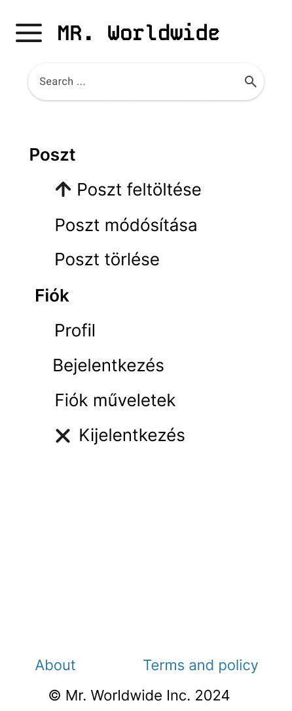
#### Lenyított navigációs menü
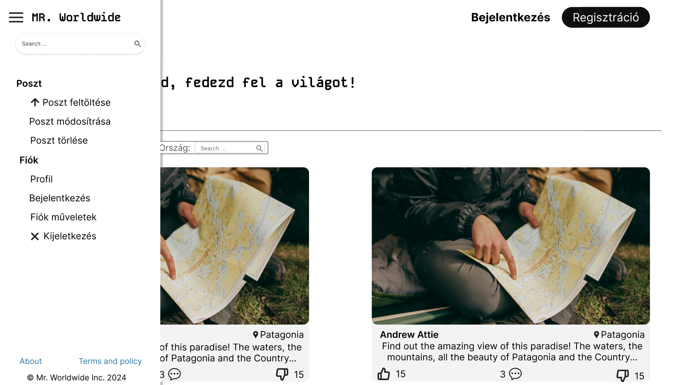
#### Bejelentkezés oldal
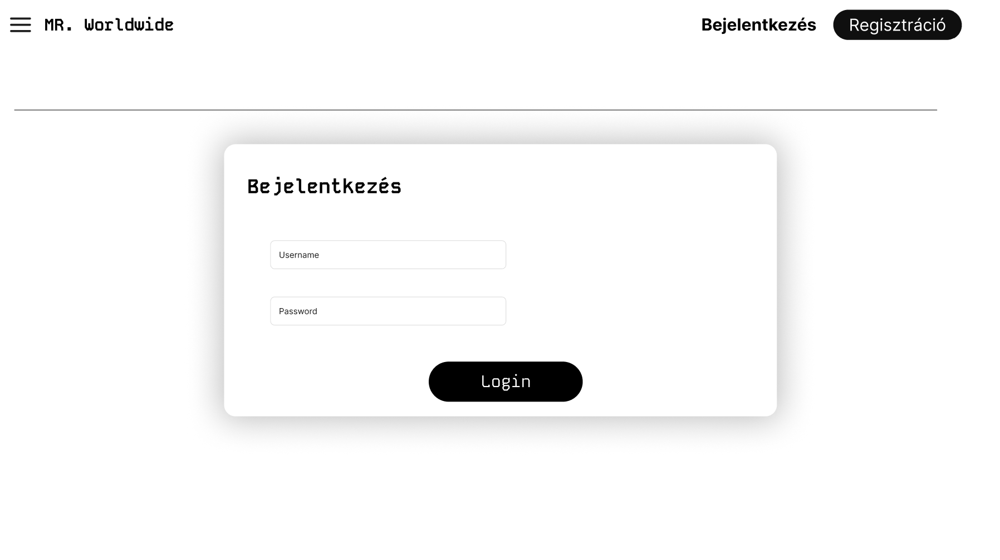
#### Regisztráció oldal
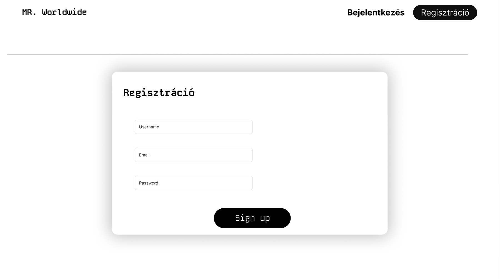
#### Hírfolyam oldal
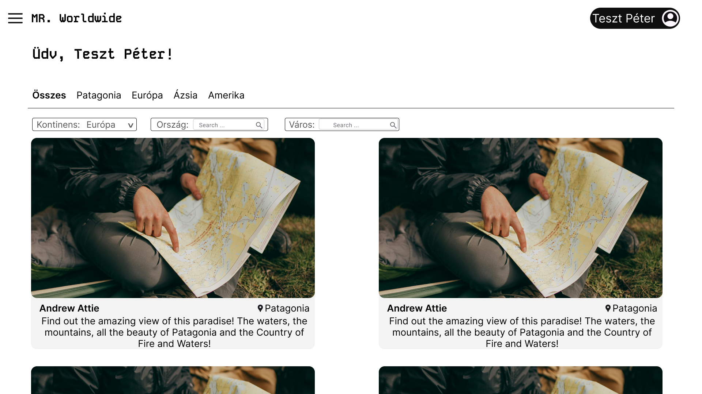
#### Kinyított poszt oldal, látogatói nézetben

#### Kinyított poszt oldal, felhasználói nézetben
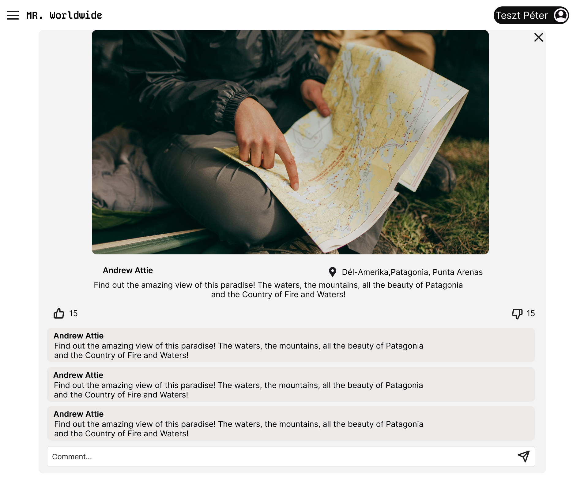
#### Profil oldal, felhasználói nézetben
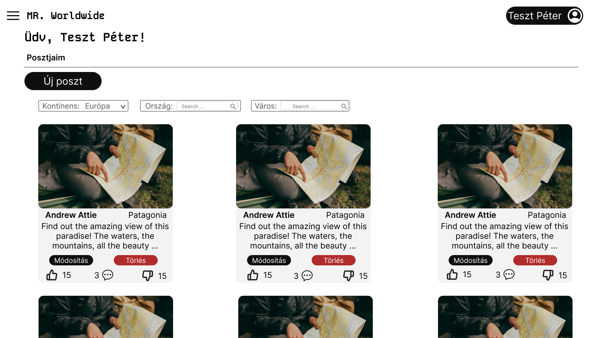
#### Profil oldal, admin nézetben

#### Poszt feltöltése oldal
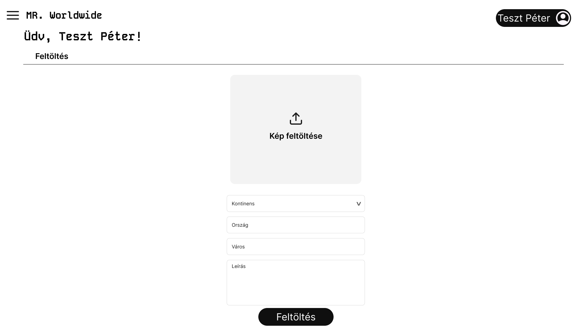
#### Poszt módosítása oldal
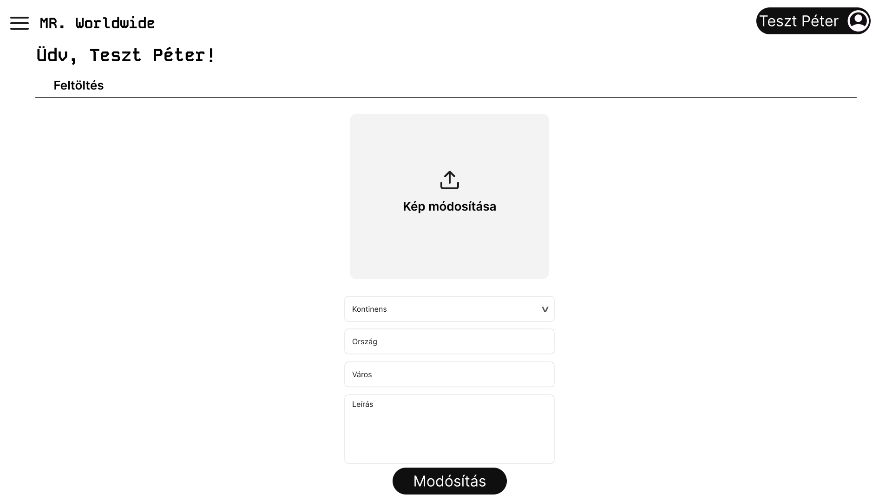
#### Fiók kezelése oldal

### Mobil nézetek:

#### Érkezési oldal

#### Lenyított navigációs menü

#### Bejelentkezés oldal
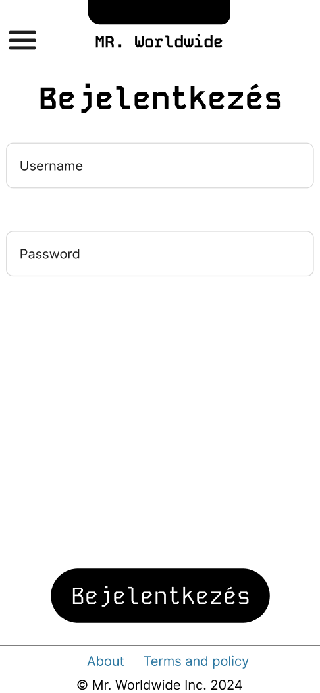
#### Regisztráció oldal
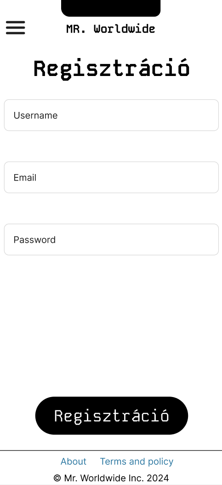
#### Hírfolyam oldal

#### Kinyított poszt oldal, látogatói nézetben

#### Kinyított poszt oldal, felhasználói nézetben

#### Profil oldal, felhasználói nézetben

#### Profil oldal, admin nézetben

#### Poszt feltöltése oldal

#### Poszt módosítása oldal

#### Fiók kezelése oldal

## Forgatókönyv:

### 1. Érkezési Oldal
- **Célja**: A látogatók üdvözlése és a weboldal bemutatása.
- **Fő elemek**:
    - **Navigációs sáv(Hamburger menü)**
    - **Hős szekció**:
        - Üdvözlése a felhasználónak.
        - A felhasznéló posztjai edit módban.
        - **Call to Action (CTA)** gombok: "Új poszt".

---

### 2. Profil oldal
- **Célja**: A felhasználó látja és szerkesztheti a saját posztjait, illetve új posztokat is hozzáadhat.
- **Fő elemek**:
    - **Navigációs sáv(Hamburger menü)**: Logó, Hamburger menü, Menüpontok (Poszt (Poszt feltöltése, Poszt módosítása, Poszt törlése), Fiók (Profil, Bejelntkezés, Fiók műveletek, Kijelentkezés)), cégnév, about leíró oldal, Term and policy.
    - **Hős szekció**:
        - Nagy, figyelemfelkeltő szöveg.
        - Posztok
        - **Call to Action (CTA)** gombok: "Bejelentkezés", "Regisztrálás".

---

### 3. Bejelentkezés/Regisztráció
- **Célja**: A látogató (guest) bejelentkezthet vagy regisztrálhat.
- **Fő elemek**:
    - **Navigációs sáv(Hamburger menü)**: Logó, Hamburger menü, Menüpontok (Poszt (Poszt feltöltése, Poszt módosítása, Poszt törlése), Fiók (Profil, Bejelntkezés, Fiók műveletek, Kijelentkezés)), cégnév, about leíró oldal, Term and policy.
    - **Hős szekció**:
        - Bejelentkezési űrlap/Regisztrációs űrlap
   - **Lábléc**: Adathasználati irányelvek és a cég neve

---

### 4. Fiók műveletek
- **Célja**: A felhasználó itt tud módosítasokat végrhajtani a fiókjával kapcsolatban.
- **Fő elemek**:
    - **Navigációs sáv(Hamburger menü)**: Logó, Hamburger menü, Menüpontok (Poszt (Poszt feltöltése, Poszt módosítása, Poszt törlése), Fiók (Profil, Bejelntkezés, Fiók műveletek, Kijelentkezés)), cégnév, about leíró oldal, Term and policy.
    - **Hős szekció**:
        - Egy felhasználónév csere űrlap.
        - Egy jelszó csere űrlap.
        - Egy fiók törlése gomb.

---

### 5. Megnyitott Poszt
- **Célja**: A felhasználó/látogató (guest) itt tudja a képet nagyobb formátumban megnézni, illetve a kommenteket. A felhasználó új kommentet is tud hozzáadni. Illetve mind a felhasználó, mind a látogató (guest) tudja értékelni a posztot.
- **Fő elemek**:
    - **Navigációs sáv(Hamburger menü)**: Logó, Hamburger menü, Menüpontok (Poszt (Poszt feltöltése, Poszt módosítása, Poszt törlése), Fiók (Profil, Bejelntkezés, Fiók műveletek, Kijelentkezés)), cégnév, about leíró oldal, Term and policy.
    - **Hős szekció**:
        - A kép.
        - A poszt helye a világban.
        - Értékelések.
        - Kommentek és/vagy komment írása.

---

### 6. Hírfolyam
- **Célja**: A felhasználó/látogató (guest) láthatja mások posztjai, illetve szűrhet közöttük.
- **Fő elemek**:
    - **Navigációs sáv(Hamburger menü)**: Logó, Hamburger menü, Menüpontok (Poszt (Poszt feltöltése, Poszt módosítása, Poszt törlése), Fiók (Profil, Bejelntkezés, Fiók műveletek, Kijelentkezés)), cégnév, about leíró oldal, Term and policy.
    - **Hős szekció**:
        - Köszöntő rész
        - Szűrési sáv.
        - Posztok

---

### 7. Poszt feltöltése
- **Célja**: A felhasználó/admin itt tud új posztot hozzáadni.
- **Fő elemek**:
    - **Navigációs sáv(Hamburger menü)**: Logó, Hamburger menü, Menüpontok (Poszt (Poszt feltöltése, Poszt módosítása, Poszt törlése), Fiók (Profil, Bejelntkezés, Fiók műveletek, Kijelentkezés)), cégnév, about leíró oldal, Term and policy.
    - **Hős szekció**:
        - Kép beillesztésének helye
        - Adatok a posztról
        - Feltöltés gomb.
   - **Megközelíthetőség**: A felhasználó/admin vagy a menüből érheti el, vagy a profiljából az "Új poszt" gombra kattintva.

---

### 8. Poszt módosítása
- **Célja**: A felhasználó/admin itt tud meglévő posztot módosítani.
- **Fő elemek**:
    - **Navigációs sáv(Hamburger menü)**: Logó, Hamburger menü, Menüpontok (Poszt (Poszt feltöltése, Poszt módosítása, Poszt törlése), Fiók (Profil, Bejelntkezés, Fiók műveletek, Kijelentkezés)), cégnév, about leíró oldal, Term and policy.
    - **Hős szekció**:
        - Kép módosításának helye
        - Adatok a posztról és annak a megváltozatatása
        - Módoítás gomb.
   - **Megközelíthetőség**: A felhasználó/admin csak a profiljából a poszt alatti "Módosítás" gombra kattintva érheti el.

---
