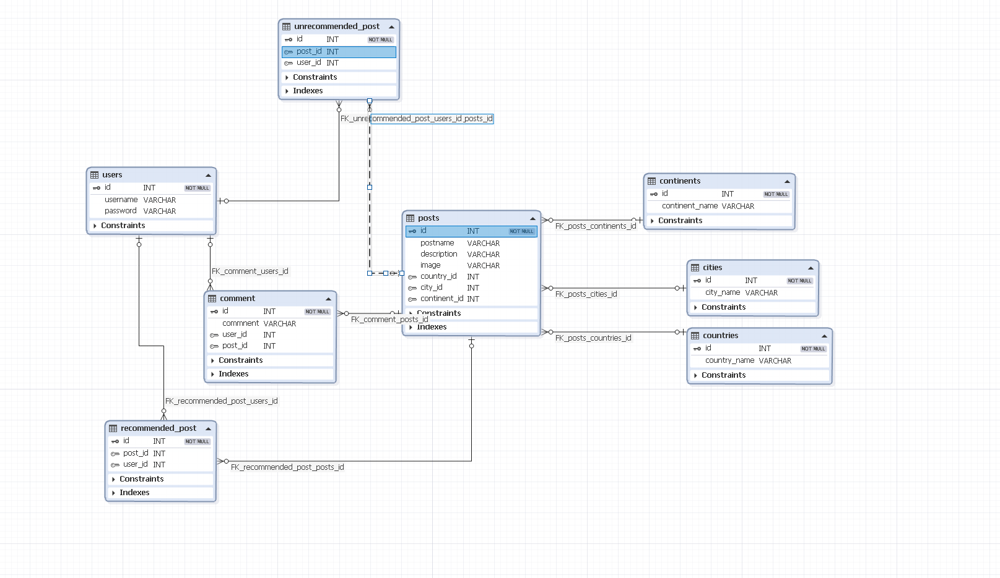

# Mr. Wordlwide
## Követelmény specifikáció:
### Áttekintés:
Az alkalmazás célja a kirándulni, utazni vágyó emberek segítése egy könnyen használható, egyszerűen átlátható weboldal segítségével. Ezenkívül szeretnénk programunkkal összekötni a kirándulókat bárhol is legyenek a világban és hasznos információkhoz, tapasztalatokhoz juttatni őket.

Az alkalmazás rendelkezik Web felülettel, ahol elérhető az összes felhasználói funkció. Az úticélok, túrista látványosságok kontinens, azon belül országok és végül városok szerint vannak osztályozva. A felhasználónak lehetősége van a saját véleményét megosztani másokkal és elolvasni mások mit gondolnak az adott helyről.
### Jelenlegi helyzet:
A MR.WorldWide platform célja, hogy összekapcsolja a bloggereket és az olvasókat, lehetővé téve számukra, hogy megosszák tapasztalataikat és felfedezéseiket különböző helyekről amiket már meglátogadtak.
A platform a felhasználói élményre specifikálódik, hogy minél könnyedébben tudjanak az olvasók elérni különböző blogokat.

### Vágyálom rendszer:
A projekt célja egy olyan rendszer, amely az utazni vágyó felhasználók számára kényelmes, egyszerű és hatékony böngészését biztosítja. Célunk, hogy a felhasználó naprakész információkat kaphasson az elérhető úticélokról, látványosságokról. A web oldalt látogatók csak megtekinteni képesek a különböző posztokat, majd regisztrációt követően a rendszer lehetővé teszi a felhasználók számára egyes posztokhoz való hozzászólást és azok kedvelését. A rendszernek van egy admin felülete is, ahol az admin képes új posztokat létrehozni, azokat módosítani vagy éppen törölni.

Kifinomult, letisztult és elegáns felülettel rendelkezik a program, hogy felkeltse a felhasználók figyelmét. Ezenkívül reszponzív felülettel rendelkezik, mely lehetővé teszi, hogy az online megjelenés mobil telefonon vagy akár tableten is működjön.

### Jelenlegi üzleti folyamatok:
3.Jelenlegi üzleti folyamatok a MR.WorldWide platformon

3.1. Blogbejegyzések nyilvántartása

3.1.1. Új blogbejegyzés létrehozása
- A blogger saját döntése alapján készíti a bejegyzést.
- A bejegyzés dokumentálva van, majd publikálva a platformon.

3.1.2. Blogbejegyzés eltávolítása
- A blogger dönt a bejegyzés törléséről.
- Az adminisztrációs felületen keresztül eltávolítja a tartalmat, ami manuálisan is rögzítésre kerül egy nyilvántartásban.

3.2. Blogmegjelenítés és olvasói interakciók
- Az olvasók regisztráció vagy bejelentkezés után tudnak hozzászólni a blogbejegyzésekhez illetve likeolni.
- A kommenteket közvetlenül a blogbejegyzés alatt lehet megírni, amit a rendszer azonnal rögzít.

### Igényelt üzleti folyamatok:
4.‎‎‎Igényelt üzleti folyamatok a MR.WorldWide platformon

4.1 Online megjelenés

4.1.1. Blogbejegyzés felvitele az adatbázisba
- Adminisztrátor jogosultsággal belépés
- Adminisztráció menü kiválasztása
- Új blogbejegyzés felvitel menüpont kiválasztása
- Adatok megadása (cím, leírás, képek, címkék)
- Véglegesítés

4.1.2. Blogbejegyzés szerkesztése
- Adminisztrátor jogosultsággal belépés
- Adminisztráció menü kiválasztása
- Blogbejegyzések listája megnyitása
- Kiválasztott bejegyzés szerkesztése (módosítások végrehajtása)
- Véglegesítés

4.1.3. Blogbejegyzés törlése
- Adminisztrátor jogosultsággal belépés
- Adminisztráció menü kiválasztása
- Blogbejegyzések listája megnyitása
- Kiválasztott bejegyzés törlése (megerősítés kérése)
- Törlés végrehajtása

4.1.4. Blogger regisztrálása
- Felhasználói regisztrációs űrlap kitöltése
- Adatok megadása (felhasználónév, email cím, jelszó)
- Regisztráció elküldése

4.1.5. Blog olvasása
- Felhasználó bejelentkezése (opcionális)
- Keresési funkció használata (kontinens, ország, város)
- Kiválasztott blogbejegyzés megnyitása és olvasása

4.1.6. Blog kommentelése
- Regisztrált felhasználó bejelentkezése
- Kiválasztott blogbejegyzés megnyitása
- Kommentmező kitöltése
- Komment elküldése

4.1.7 Blog like-olása
- Regisztrált felhasználó bejelentkezése
- Kiválasztott blogbejegyzés megnyitása
- Like gomb megnyomása
- A rendszer regisztrálja a lájkot, és frissíti a lájkok számát a bejegyzésnél
- Visszajelzés a felhasználónak, hogy a lájk sikeresen rögzítésre került

### A rendszerre vonatkozó szabályok:
Az alkalmazás tárol bizonyos adatokat a felhasználóról, (felhasználónév, email, jelszó) ezért a programra és a felhasználóra az Európai Únió [General Data Protection Regulation (GDPR)](https://gdprinfo.eu/hu) rendeletében foglalt jogszabályok érvényesek.

MIT License

Copyright (c) 2024 Mr.WorldWide

Permission is hereby granted, free of charge, to any person obtaining a copy
of this software and associated documentation files (the "Software"), to deal
in the Software without restriction, including without limitation the rights
to use, copy, modify, merge, publish, distribute, sublicense, and/or sell
copies of the Software, and to permit persons to whom the Software is
furnished to do so, subject to the following conditions:

The above copyright notice and this permission notice shall be included in all
copies or substantial portions of the Software.

THE SOFTWARE IS PROVIDED "AS IS", WITHOUT WARRANTY OF ANY KIND, EXPRESS OR
IMPLIED, INCLUDING BUT NOT LIMITED TO THE WARRANTIES OF MERCHANTABILITY,
FITNESS FOR A PARTICULAR PURPOSE AND NONINFRINGEMENT. IN NO EVENT SHALL THE
AUTHORS OR COPYRIGHT HOLDERS BE LIABLE FOR ANY CLAIM, DAMAGES OR OTHER
LIABILITY, WHETHER IN AN ACTION OF CONTRACT, TORT OR OTHERWISE, ARISING FROM,
OUT OF OR IN CONNECTION WITH THE SOFTWARE OR THE USE OR OTHER DEALINGS IN THE
SOFTWARE.
### Követelménylista:
1. Funkcionális Követelmények

1.1 Felhasználói kezelés
- Regisztráció és Bejelentkezés: A felhasználók regisztrálhatnak e-mail cím vagy közösségi média fiók segítségével.
- Felhasználói Profil: Felhasználók létrehozhatnak és szerkezhetik a saját profiljukat beleértve a kapcsolati információikat és profilképüket.

1.2 Tartalom kezelés
- Blogbejegyzés Készítése: Felhasználók új blogokat írhatnak, szerkeszthetnek és közzéthetnek.
- Tartalom Formázás: Bejegyzések formázása a webolalon.
- Kategorizálás: Bejegyzések kategorizálásának lehetősége.
- Kép feltöltés: A bejegyzésekhez képeket tölthetnek fel.

1.2 Keresés és Navigáció
- Keresőfunkció: Felhasználók keresési lehetősége bejegyzések eléréséhez.
-Navigáció: Weboldalon könnyű navigáció kategóriák alapján.

1.4 Interakció és Közösségi Funkciók
- Kommentelés: Felhasználók kommentelhetnek blogbejegyzések alatt.
- Like: Bejegyzések lájkolhatók

1.6 Adminisztráció
- Admin: Adminisztrátorok hozzáférhetnek a felhasználói fiókok kezelésére és a tartalom moderálására.

## Funkcionális specifikáció:
### Áttekintés:
Egy olyan rendszert fejlesztünk, amely segíti az utazni vágyókat szerte a világon véleményt alkotni különféle túrista látványosságokról és segítséget nyújt az úticél kiválasztásában. Célunk még, hogy a felhasználó a legfrissebb információkhoz jusson hozzá az alkalmazáson keresztül, ezáltal pontosabb képet alkotva a helyről.

Természetesen nem csak számítógépen lesz elérhető az alkalmazás, hanem célunk hogy minél több platformon hozzá lehessen férni, legyen az tablet vagy telefon.
Ez a rendszer ingyenes lesz, ezért bárki bárhonnan interneten keresztül képes lesz használni vendégként vagy akár regisztrálni és becsatlakozni a nemzetközi kirándulók közösségébe.

Minden regisztrált felhasználónak lehetősége van egy adott poszthoz, azaz látványossághoz hozzáfűzni a saját véleményét, tapasztalatait, és akár az erre a célre kialakított gombok segítségével ajánlhatja is őket vagy éppen nem. Ezeket a hozzászólásokat és az ajánlások arányát a webhely minden látogatója megtekinthet, ezzel is segítve a túrázni vágyókat.
### Jelenlegi helyzet:
A rendszer segítséget nyújt azok számára, akik valamilyen módon szeretnék tudásukat elmélyíteni egy adott területen, vagy új ismereteket szeretnének szerezni, új helyeket meglátogatni és kirándulni. A XXI. század megköveteli, hogy mindez hálózaton is elérhető legyen, ennek megfelelően a weboldalt a megrendelő rendelkezésére kell bocsátani.

A megrendelő keresett már meglévő alkalmazások és webhelyek közül, amely megfelelő lenne számára, de egyik sem tetszett igazán, ezen okokból kifolyólag megkértek minket, hogy csináljuk meg nekik a vágyott alkalmazást, ami sokkal könnyebbé teheti számukra az információ szerzést és az úticél kiválasztását.
### Követelménylista:
| Modul       | ID  | Név                       | v.  | Kifejtés                                                                                                                                                                                                                                                                             |
|-------------|-----|---------------------------|-----|--------------------------------------------------------------------------------------------------------------------------------------------------------------------------------------------------------------------------------------------------------------------------------------|
| Jogosultság | F1  | Bejelentkezési felület    | 1.0 | A felhasználó az email címe és a jelszava segítségével bejelentkezhet. Ha a megadott email cím vagy jelszó nem megfelelő, akkor a felhasználó hibaüzenetet kap.                                                                                                                      |
| Jogosultság | F2  | Regisztráció              | 1.0 | A felhasználó a felhasználói nevének, email címének és jelszavának megadásával regisztrálja magát. A jelszó tárolása kódolva történik az adatbázisban. Ha valamelyik adat ezek közül hiányzik vagy nem felel meg a követelményeknek, akkor a rendszer értesíti erről a felhasználót. |
| Jogosultság | F3  | Jogosultsági szintek      | 1.0 | **Admin:** Úticélok hozzáadása, módosítása, törlése \| **Felhasználó:** Hozzászólás, ajánlás, jelszó módosítása \| **Vendég:** Megtekintés, regisztráció, belépés                                                                                                                    |
| Modifikáció | F4  | Felhasználónév módosítása | 1.0 | A felhasználó módosítani tudja saját felhasználónevét. Ehhez szükséges a régi és az új felhasználók megadása, az új megerősítése, valamint a felhasználó jelszavának megadása.                                                                                                       |
| Modifikáció | F5  | Jelszó módosítása         | 1.0 | A felhasználó módosítani tudja saját jelszavát. Ehhez szükséges a régi és az új jelszavának megadása, valamint az új megerősítése.                                                                                                                                                   |
| Felület     | F6  | Főoldal                   | 1.0 | Az úgy nevezett "landing page"-je az oldalnak, ahol a felhasználók megtekinthetik a webhely tartalmát.                                                                                                                                                                               |
| Felület     | F7  | Hozzászólás               | 1.0 | A felhasználónak lehetősége van hozzászólni a poszthoz.                                                                                                                                                                                                                              |
| Felület     | F8  | Ajánlás                   | 1.0 | A felhasználónak lehetősége van ajánlani vagy éppen nem az adott helyet.                                                                                                                                                                                                             |
| Felület     | F9  | Kereső                    | 1.0 | A felhasználónak lehetősége van különböző filterek alapján keresni a posztok között.                                                                                                                                                                                                 |
| Jogosultság | F10 | Admin felület             | 1.0 | Felület az admin fiókkal rendelkező felhasználó számára. Tartalmaz egy felületet az új posztok feltöltéséhez.                                                                                                                                                                        |
### Jelenlegi üzleti folyamatok modellje:
A jelenlegi üzleti folyamatok az utazási és turisztikai ágazatban hagyományosan manuális és széttöredezett módszereket alkalmaznak az információk elérésére és megosztására. A turisták többnyire különböző forrásokat használnak (útikönyvek, blogok, weboldalak) az utazási célpontjaik kiválasztásához, és az értékelések, valamint a helyi tapasztalatok gyűjtése gyakran nehézkes és nem megbízható.

**Jelenlegi problémák:**
- A felhasználók nehezen találnak megbízható és naprakész információkat az úticélokról egy központi helyen.
- A turisták különböző forrásokat böngésznek át, hogy összehasonlítsák a látványosságokat és az élményeket, ami időigényes.
- A vélemények és értékelések gyakran szét vannak szórva több platformon, így a turisták számára nehéz megtalálni a releváns információkat.
- Az interakció a turisták között nem központi vagy egyszerű, a tapasztalatok megosztása korlátozott.
- Az utazók személyes tapasztalataik megosztása kevésbé interaktív vagy struktúrált formában történik, blogokon vagy közösségi médiában.
- A turisztikai ipar nem használja ki teljes mértékben a digitális technológiákat a felhasználók bevonására és az információk naprakészen tartására.

---
### Igényelt üzleti folyamatok modellje:
Az igényelt modell célja, hogy egyszerűsítse és központosítsa a turisták számára az információk elérését és megosztását egy felhasználóbarát, interaktív platformon keresztül. Az új rendszer lehetővé teszi a felhasználók számára, hogy gyorsan és hatékonyan hozzáférjenek a turisztikai látványosságokhoz kapcsolódó információkhoz, valamint közösségi élményt biztosít a vélemények és értékelések megosztásához.

**Fejlesztendő megoldások:**
- Egy központi, jól strukturált weboldal, ahol a felhasználók kontinens, ország és város szerint kereshetnek látványosságokat.
- A felhasználók számára lehetőség nyílik vélemények megosztására és mások véleményeinek olvasására közvetlenül az oldalon.
- Valós idejű értékelési és visszajelzési funkciók biztosítása, hogy az utazók friss és releváns információkat kapjanak.
- A felhasználók közötti interakció növelése a hozzászólási és értékelési funkciók fejlesztésével.
- Az úticélokhoz kapcsolódó ajánlások és szűrők beépítése, hogy a felhasználók személyre szabott utazási élményt kapjanak.
- A felhasználók számára létrehozható profilok, ahol összegyűjthetik az általuk meglátogatott helyeket, és megoszthatják tapasztalataikat.

**Előnyök:**
- Központosított információforrás, amely leegyszerűsíti az utazás tervezését és az értékelésekhez való hozzáférést.
- Gyors és könnyen használható rendszer, amely csökkenti az információk keresésével töltött időt.
- A közösségi élmények megosztása növeli a felhasználók elkötelezettségét és a platform interaktivitását.
  
---
### Használati esetek:
**Felhasználói szerepkörök:**

1. **REGISZTRÁLT FELHASZNÁLÓ:**
   - Kereshet úticélokat, turisztikai látványosságokat kontinensek, országok és városok szerint.
   - Véleményt írhat és olvashat más felhasználók tapasztalatairól.
   - Hozzászólhat és értékelheti a látványosságokat.
   - Saját utazási élményeit megoszthatja.

2. **LÁTOGATÓ (regisztráció nélkül):**
   - Böngészhet az úticélok és látványosságok között, de nem írhat véleményt vagy értékelést.
   - Megtekintheti más felhasználók véleményeit és értékeléseit.

3. **ADMINISZTRÁTOR:**
   - Teljes hozzáféréssel rendelkezik a rendszerhez, beleértve a felhasználói adatok kezelését és a moderációs funkciókat.
   - Ellenőrzi a felhasználók által megosztott tartalmakat, és moderálja a véleményeket, hogy biztosítsa a platform biztonságát és hitelességét.
   - Új látványosságokat és úticélokat adhat hozzá az adatbázishoz.
   - Képes felhasználói fiókokat létrehozni vagy törölni, valamint globális üzeneteket küldeni a felhasználók számára.

**Használati esetek példái:**

1. **Úticél keresése:**
   - A felhasználó bejelentkezik, keres egy adott országot vagy várost, és megtekinti a látványosságok listáját.
   - Kiválaszt egy helyszínt, és elolvassa mások értékeléseit és véleményeit.

2. **Vélemény írása:**
   - Egy felhasználó meglátogat egy látványosságot, majd értékelést és tapasztalatot ír az oldalra.
   - Más felhasználók hozzászólhatnak a véleményhez, és értékelhetik azt (pl. "hasznos" vagy "nem hasznos").

3. **Adminisztrátor beavatkozása:**
   - Az adminisztrátor egy problémás tartalmat észlel a vélemények között, amely nem felel meg az irányelveknek, és eltávolítja azt a platformról.
   - Új úticélokat ad hozzá, amelyekről a felhasználók véleményt alkothatnak.

---
### Megfeleltetés:
### Képernyő tervek:
### Forgatókönyv:
## Rendszerterv:
### A rendszer célja:
### Projektterv:
### Üzleti folyamatok modellje:
### Követelmények:
### Funkcionális terv:
**Rendszerszereplők:**
- Admin
- Felhasználó
- Vendég

**Rendszerhasználati esetek és lefutásaik:**

ADMIN:
- Beléphet bármilyen szereplőként teljes hozzáférése van a rendszerhez
- A felhasználói adatokat látják
- Új poszt hozzáadása
- Meglévő posztok módosítása
- Meglévő posztok törlése
- Hozzászólás hozzáadása poszthoz
- Poszt ajánlása vagy nem ajánlása
- Keresés a posztok között filterek segítségével

FELHASZNÁLÓ:
- A felhasználói adatokat látják
- Új poszt hozzáadása
- Meglévő posztok módosítása
- Meglévő posztok törlése
- Hozzászólás hozzáadása poszthoz
- Poszt ajánlása vagy nem ajánlása
- Keresés a posztok között filterek segítségével

VENDÉG:
- A felhasználói adatokat látják
- Keresés a posztok között filterek segítségével

**Menü-hierarchiák:**

- BEJELENTKEZÉS
    - Bejelentkezés
    - Regisztráció

- NAVIGÁCIÓS MENÜ
    - Új poszt (Felhasználó, Admin)
    - Poszt módosítása (Felhasználó, Admin)
    - Poszt törlése (Felhasználó, Admin)
    - Keresés
    - Fiók
    - Bejelentkezés
    - Regisztráció
    - Kijelentkezés

- FIÓK
    - Felhasználónév módosítása
    - Jelszó módosítása
    - Fiók törlése
### Fizikai környezet:
- Platformok:
Az alkalmazás egy web alapú platformra készül, amely elérhető lesz asztali böngészőkben és hordozható eszközökön (okostelefonok, táblagépek).

- Fejlesztői eszközök
Visual Studio Code: Kódszerkesztő és integrált fejlesztőkörnyezet (IDE).
DbForge: Adatbázis kezelési és tervezési eszköz.
### Absztakt domain modell:
Felhasználók: A blog platform különböző felhasználói szerepekkel rendelkezik:

- Adminisztrátorok: Adminisztrációs jogkörökkel rendelkeznek a blogok moderálását.
- Felhasználók: Olyan regisztrált felhasználók, akik jogosultak blogbejegyzéseket közzétenni és szerkeszteni.
- Vendég: A blog platform látogatói, akik megtekinthetik a bejegyzéseket.

- Blog bejegyzés:
Egy bejegyzés tartalmazza a címet, tartalmat, szerző nevét, és metaadatokat.

- Kommentek:
A felhasználók kommenteket fűzhetnek a bejegyzésekhez.

- Felhasználói profilok:
A felhasználók saját profiloldallal rendelkeznek, ahol megjelenik a felhasználói nevük, a közzétett bejegyzéseik listája.
### Architekturális terv:
Backend (Saját MVC keretrendszer):
A backend az egyedi MVC (Model-View-Controller) architektúra alapján épül fel, amely tiszta elkülönítést biztosít a logika, az adatkezelés és a megjelenítés között. 

- Model (Adatkezelés):
A modellek az adatbázis műveletekért felelősek, és kapcsolatot tartanak az adatbázissal. Az adatbázis kezelése a dbForge segítségével történik, amely egy fejlett eszköz az adatbázis tervezéséhez, lekérdezéséhez és optimalizálásához.
A modellek kezelik a következő adatokat:

- Blog bejegyzések: Tárolják a bejegyzés címét, tartalmát és metaadatait (címkék, kategóriák).
Felhasználók: Regisztrált felhasználók adatai, beleértve a felhasználónevet, jelszót, email címet és profiladatokat.
- Kommentek: A felhasználói hozzászólások, amelyek kapcsolódnak a blog bejegyzésekhez.
- Controller (Üzleti logika):
A kontroller réteg felelős a felhasználói kérések fogadásáért és az ezekre adott válaszok feldolgozásáért.

- Blogkezelés: A felhasználók új blogbejegyzéseket hozhatnak létre, meglévőket szerkeszthetnek vagy törölhetnek. A bejegyzések adatainak kezelését a kontroller végzi, és meghívja a megfelelő modellt az adatbázis műveletekhez.
- Felhasználói hitelesítés: A bejelentkezési és regisztrációs folyamatok kezelése, jelszó ellenőrzés, valamint session-kezelés.
- Kommentkezelés: A felhasználók hozzászólásainak létrehozása, szerkesztése és moderálása. Minden hozzászólás a megfelelő blog bejegyzéshez kapcsolódik, és a kontroller kezeli a validációt, mielőtt az adatbázisba kerülne.
- View (Megjelenítés):
A nézetek (View-k) HTML alapú megjelenítést biztosítanak.

- A nézetek felelősek a blogbejegyzések, kommentek és felhasználói profilok megjelenítéséért.
- A felhasználói interakciókat (pl. új bejegyzés írása, komment hozzáadása) közvetlenül a böngészőn keresztül, szerveroldali feldolgozással kezeljük. A frissítések a nézeteken keresztül történnek újra betöltéssel vagy form-kezdeményezett POST kérésekkel.
- Adatbázis (dbForge és MySQL):
- Az adatbázis-kezelést MySQL végzi, amely a blogbejegyzéseket, felhasználói adatokat, kommenteket és egyéb kapcsolódó adatokat tárol.
- dbForge-ot használunk az adatbázis tervezésére, karbantartására és a lekérdezések optimalizálására. A dbForge biztosítja az adatbázis struktúrák, relációk és indexelések vizuális kezelését, ami megkönnyíti az adatbázis fejlődésének nyomon követését és hatékony működését.
Az adatbázisban a következő táblák találhatók:
- Users (Felhasználók): Felhasználói profilok, hitelesítési adatok (pl. felhasználónév, jelszó, email).
- Posts (Bejegyzések): Blogbejegyzések adatai (pl. cím, tartalom, szerző, dátum).
- Comments (Kommentek): Hozzászólások tárolása, amelyek egy adott blogbejegyzéshez kapcsolódnak.
- Biztonság:
- A felhasználói jelszavak bcrypt alapú titkosítással vannak tárolva az adatbázisban.

### Adatbázis terv:

### Implementációs terv:
### Tesztterv:
### Telepítési terv:
### Karbantartási terv:

