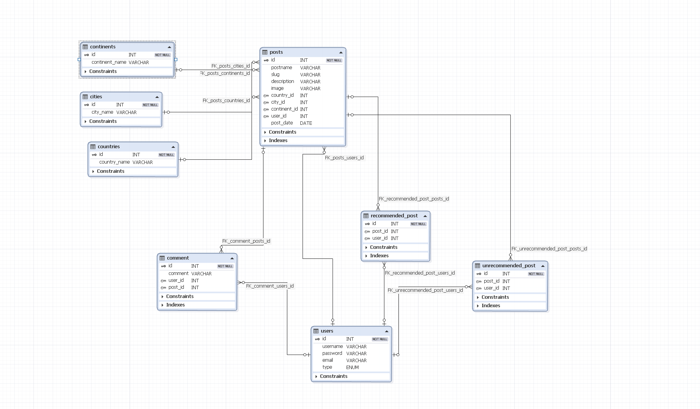

# Rendszerterv:
## A rendszer célja:
A rendszer célja, hogy a kirándulni és utazni vágyó felhasználók számára egy könnyen használható, átlátható weboldalt biztosítson, amely segít összekötni a turistákat világszerte, és hasznos információkat, tapasztalatokat nyújtson számukra. Az alkalmazás lehetőséget ad arra, hogy a felhasználók úticélokat, túrista látványosságokat fedezzenek fel, amelyek kontinensek, országok, majd városok szerint vannak kategorizálva. A felhasználók megoszthatják saját véleményüket és tapasztalataikat az adott helyszínekről, valamint elolvashatják mások visszajelzéseit is. A rendszer kizárólag webes felületen érhető el, minimalista felhasználói felülettel, amely biztosítja a könnyű navigációt és a gyors információelérést. Célunk, hogy a felhasználók számára egy közösségi platformot teremtsünk, ahol megoszthatják élményeiket és javaslataikat más kirándulókkal.

---
## Projektterv:
- **Scrum master:** Dobrosi Gergő
  Feladata a fejlesztési folyamatok koordinálása, a csapat támogatása a munkafolyamatok gördülékeny működésében.

- **Product owner:** Székely Zsolt
  Felelős az alkalmazás céljainak meghatározásáért és az ügyféligények képviseletéért. Prioritásokat állít fel a fejlesztési backlog alapján.

- **Projektmunkások és felelősségek:**

  - **Frontend fejlesztők:**
    Feladatuk az alkalmazás webes felületének kialakítása, a felhasználói élmény megtervezése és megvalósítása.

  - **Backend fejlesztők:**
    Feladatuk az adatbázis felépítése, az adatszerkezetek megtervezése és a Web Service megvalósítása, amely az alkalmazás adatait biztosítja.

  - **UI/UX tervezők:**
    Felelősek az egyszerű, intuitív felhasználói felület megtervezéséért, amely segíti a felhasználókat az alkalmazás használatában.

  - **Tesztelők:**
    Feladatuk az alkalmazás funkcióinak és teljesítményének ellenőrzése, hibakeresés és visszajelzések küldése a fejlesztők számára.

**Ütemterv:**

| Funkció / Story              | Feladat / Task                     | Prioritás | Becslés (óra) | Aktuális becslés | Eltelt idő (óra) | Hátralévő idő (óra) |
|------------------------------|------------------------------------|-----------|---------------|------------------|------------------|---------------------|
| Követelmény specifikáció      | A rendszer igényeinek felmérése    | 0         | 16            | 16               | 16               | 0                   |
| Funkcionális specifikáció     | Az alapvető funkciók meghatározása | 0         | 12            | 12               | 8                | 4                   |
| Rendszerterv                  | Műszaki dokumentáció elkészítése   | 0         | 20            | 20               | 12               | 8                   |
| Adattárolás                   | Adatmodell megtervezése            | 0         | 8             | 8                | 4                | 4                   |
| Adatbázis megvalósítása       | Szerveren futó adatbázis létrehozása| 1         | 10            | 10               | 5                | 5                   |
| Frontend fejlesztés           | Felhasználói felület kialakítása   | 2         | 20            | 20               | 10               | 10                  |
| Véleményezés funkció          | Vélemények megosztásának megoldása | 2         | 10            | 10               | 5                | 5                   |
---

**Mérföldkövek:**

1. **Követelmény specifikáció bemutatása** – Sikeresen befejeződött, minden kulcsfontosságú igény meghatározásra került.
2. **Adatmodell bemutatása** – Az adatstruktúrák elkészültek, és jóváhagyásra kerültek a backend fejlesztés megkezdése előtt.
3. **Első felhasználói teszt** – A felhasználói felület alapverziója készen áll a tesztelésre.
4. **Backend integráció tesztelése** – A Web Service és az adatbázis összekapcsolása megtörtént.

Az ütemterv folyamatosan frissül a fejlesztés előrehaladtával, és a Scrum módszertan alapján történik a feladatok kiértékelése és újraütemezése.

---
## Üzleti folyamatok modellje:

## Követelmények:
**Funkcionális követelmények:**

- A felhasználóknak lehetőséget kell biztosítani arra, hogy regisztráljanak, bejelentkezzenek és profiljukat kezeljék.
- Az úticélok és turisztikai látványosságok kategorizálása kontinensek, országok és városok szerint.
- A felhasználók véleményeket oszthassanak meg az általuk látogatott helyekről, és más felhasználók véleményeit olvashassák.
- Lehetőség úticélok keresésére és szűrésére adott kritériumok alapján (pl. kontinens, ország, város).
- A felhasználók közötti interakciók támogatása (pl. más felhasználók értékelései, hozzászólások).
- Webes felület biztosítása, amely könnyen kezelhető és intuitív navigációt nyújt.
- Felhasználói visszajelzések kezelése (pozitív vagy negatív értékelés leadása).

**Nem funkcionális követelmények:**

- Az alkalmazásnak gyorsan kell betöltenie, különösen a keresések és a kategorizált listák megjelenítése során.
- A weboldal reszponzív kialakítású legyen, és jól használható.
- A felhasználói adatok védelme kiemelten fontos; az adatok titkosítása biztosítva legyen.
- Az alkalmazás könnyen skálázható legyen, hogy a felhasználók növekvő száma ne befolyásolja a teljesítményt.
- Az alkalmazás hibamentesen és megbízhatóan működjön hosszú ideig tartó használat során is.

**Törvényi előírások, szabványok:**

- A programnak meg kell felelnie a **GDPR** adatvédelmi előírásainak, különös tekintettel a felhasználók személyes adatainak kezelésére.
- Biztosítani kell, hogy a felhasználók ne férjenek hozzá mások személyes adataihoz, kivéve a nyilvános információkat (felhasználónév, értékelések).
- A rendszernek meg kell felelnie a nemzetközi webes szabványoknak (pl. WCAG 2.1) az akadálymentesség biztosítása érdekében.

---
## Funkcionális terv:
**Rendszerszereplők:**
- Admin
- Felhasználó
- Vendég

---

**Rendszerhasználati esetek és lefutásaik:**

ADMIN:
- Beléphet bármilyen szereplőként teljes hozzáférése van a rendszerhez
- A felhasználói adatokat látják
- Új poszt hozzáadása
- Meglévő posztok módosítása
- Meglévő posztok törlése
- Hozzászólás hozzáadása poszthoz
- Poszt ajánlása vagy nem ajánlása
- Keresés a posztok között filterek segítségével

FELHASZNÁLÓ:
- A felhasználói adatokat látják
- Új poszt hozzáadása
- Meglévő posztok módosítása
- Meglévő posztok törlése
- Hozzászólás hozzáadása poszthoz
- Poszt ajánlása vagy nem ajánlása
- Keresés a posztok között filterek segítségével

VENDÉG:
- A felhasználói adatokat látják
- Keresés a posztok között filterek segítségével

**Menü-hierarchiák:**

- BEJELENTKEZÉS
    - Bejelentkezés
    - Regisztráció

- NAVIGÁCIÓS MENÜ
    - Új poszt (Felhasználó, Admin)
    - Poszt módosítása (Felhasználó, Admin)
    - Poszt törlése (Felhasználó, Admin)
    - Keresés
    - Fiók
    - Bejelentkezés
    - Regisztráció
    - Kijelentkezés

- FIÓK
    - Felhasználónév módosítása
    - Jelszó módosítása
    - Fiók törlése
## Fizikai környezet:
- Platformok:
Az alkalmazás egy web alapú platformra készül, amely elérhető lesz asztali böngészőkben és hordozható eszközökön (okostelefonok, táblagépek).

- Fejlesztői eszközök
Visual Studio Code: Kódszerkesztő és integrált fejlesztőkörnyezet (IDE).
DbForge: Adatbázis kezelési és tervezési eszköz.
## Absztakt domain modell:
Felhasználók: A blog platform különböző felhasználói szerepekkel rendelkezik:

- Adminisztrátorok: Adminisztrációs jogkörökkel rendelkeznek a blogok moderálását.
- Felhasználók: Olyan regisztrált felhasználók, akik jogosultak blogbejegyzéseket közzétenni és szerkeszteni.
- Vendég: A blog platform látogatói, akik megtekinthetik a bejegyzéseket.

- Blog bejegyzés:
Egy bejegyzés tartalmazza a címet, tartalmat, szerző nevét, és metaadatokat.

- Kommentek:
A felhasználók kommenteket fűzhetnek a bejegyzésekhez.

- Felhasználói profilok:
A felhasználók saját profiloldallal rendelkeznek, ahol megjelenik a felhasználói nevük, a közzétett bejegyzéseik listája.
## Architekturális terv:
Backend (Saját MVC keretrendszer):
A backend az egyedi MVC (Model-View-Controller) architektúra alapján épül fel, amely tiszta elkülönítést biztosít a logika, az adatkezelés és a megjelenítés között.

- Model (Adatkezelés):
A modellek az adatbázis műveletekért felelősek, és kapcsolatot tartanak az adatbázissal. Az adatbázis kezelése a dbForge segítségével történik, amely egy fejlett eszköz az adatbázis tervezéséhez, lekérdezéséhez és optimalizálásához.
A modellek kezelik a következő adatokat:

- Blog bejegyzések: Tárolják a bejegyzés címét, tartalmát és metaadatait (címkék, kategóriák).
Felhasználók: Regisztrált felhasználók adatai, beleértve a felhasználónevet, jelszót, email címet és profiladatokat.
- Kommentek: A felhasználói hozzászólások, amelyek kapcsolódnak a blog bejegyzésekhez.
- Controller (Üzleti logika):
A kontroller réteg felelős a felhasználói kérések fogadásáért és az ezekre adott válaszok feldolgozásáért.

- Blogkezelés: A felhasználók új blogbejegyzéseket hozhatnak létre, meglévőket szerkeszthetnek vagy törölhetnek. A bejegyzések adatainak kezelését a kontroller végzi, és meghívja a megfelelő modellt az adatbázis műveletekhez.
- Felhasználói hitelesítés: A bejelentkezési és regisztrációs folyamatok kezelése, jelszó ellenőrzés, valamint session-kezelés.
- Kommentkezelés: A felhasználók hozzászólásainak létrehozása, szerkesztése és moderálása. Minden hozzászólás a megfelelő blog bejegyzéshez kapcsolódik, és a kontroller kezeli a validációt, mielőtt az adatbázisba kerülne.
- View (Megjelenítés):
A nézetek (View-k) HTML alapú megjelenítést biztosítanak.

- A nézetek felelősek a blogbejegyzések, kommentek és felhasználói profilok megjelenítéséért.
- A felhasználói interakciókat (pl. új bejegyzés írása, komment hozzáadása) közvetlenül a böngészőn keresztül, szerveroldali feldolgozással kezeljük. A frissítések a nézeteken keresztül történnek újra betöltéssel vagy form-kezdeményezett POST kérésekkel.
- Adatbázis (dbForge és MySQL):
- Az adatbázis-kezelést MySQL végzi, amely a blogbejegyzéseket, felhasználói adatokat, kommenteket és egyéb kapcsolódó adatokat tárol.
- dbForge-ot használunk az adatbázis tervezésére, karbantartására és a lekérdezések optimalizálására. A dbForge biztosítja az adatbázis struktúrák, relációk és indexelések vizuális kezelését, ami megkönnyíti az adatbázis fejlődésének nyomon követését és hatékony működését.
Az adatbázisban a következő táblák találhatók:
- Users (Felhasználók): Felhasználói profilok, hitelesítési adatok (pl. felhasználónév, jelszó, email).
- Posts (Bejegyzések): Blogbejegyzések adatai (pl. cím, tartalom, szerző, dátum).
- Comments (Kommentek): Hozzászólások tárolása, amelyek egy adott blogbejegyzéshez kapcsolódnak.
- Biztonság:
- A felhasználói jelszavak bcrypt alapú titkosítással vannak tárolva az adatbázisban.

## Adatbázis terv:

## Implementációs terv:
A Webes felület főként **HTML**, **CSS**, **PHP**, **Javascript** nyelven fog készülni.
Ezeket a technológiákat amennyire csak lehet külön fájlokba írva készítjük, és
úgy fogjuk egymáshoz csatolni a jobb átláthatóság, könnyebb változtathatóság,
és könnyebb bővítés érdekében. Képes lesz felhasználni a Backend részen futó
REST szolgáltatás metódusait, ezáltal tud felvinni és lekérdezni adatokat az
adatbázisból. Az eltelt időt a kliens fogja számolni a feladatoknál, hogy ne
legyenek eltérések. Legfőképpen PHP-t fogunk használni.
## Tesztterv:
### Unit teszt:
Minden lehetséges és fontosabb kisebb részt tesztelni, akár egy form mezőjétől a gombok működéséig, illetve a szélsőséges esetek letesztelése, akár a null, illetve nagy számok tesztjei.
### Alfa teszt:
Itt leteszteljük, hogy mindne böngészőben, illetve milyen verziókban működik a webapp.
### Beta teszt:
A termék reszponzivitásának tesztelése különboző eszközöken és technológiákon.
### Tesztelendő funkciók:
- **Bejelentkezés**
- **Regisztráció**
- **Poszt feltöltése**
- **Poszt módosítása**
- **Felhasználónév módosítása**
- **Jelszó módosítása**
- **Profil törlése**
- **Poszt értékelése**
- **Poszt kommentelése**
- **Posztok szűrése**
- **Keresési tesztek**

## Telepítési terv:
A szoftver webes felületéhez csak egy ajánlott böngésző telepítése
szükséges (Google Chrome, Firefox, Opera, Safari), külön szoftver
nem kell hozzá. A webszerverre közvetlenül az internetről
kapcsolódnak rá a kliensek.
## Karbantartási terv:
